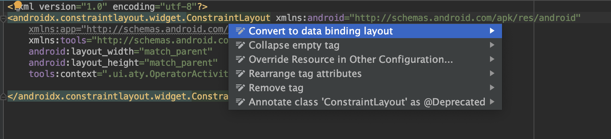

DataBinding 是谷歌官方发布的一个框架，顾名思义即为数据绑定，是 MVVM 模式在 Android 上的一种实现，用于降低布局和逻辑的耦合性，使代码逻辑更加清晰。MVVM 相对于 MVP，其实就是将 Presenter 层替换成了 ViewModel 层。DataBinding 能够省去我们一直以来的 findViewById() 步骤，大量减少 Activity 内的代码，数据能够单向或双向绑定到 layout 文件中，有助于防止内存泄漏，而且能自动进行空检测以避免空指针异常

启用 DataBinding 的方法是在对应 Model 的 build.gradle 文件里加入以下代码，同步后就能引入对 DataBinding 的支持
```gradle
android {
    dataBinding {
        enabled = true
    }
}
```
## 一、基础入门

启用 DataBinding 后，这里先来看下如何在布局文件中绑定指定的变量

打开布局文件，选中根布局的 ViewGroup，按住 Alt + 回车键，点击 “Convert to data binding layout”，就可以生成 DataBinding 需要的布局规则



```xml
<?xml version="1.0" encoding="utf-8"?>
<layout xmlns:android="http://schemas.android.com/apk/res/android"
    xmlns:app="http://schemas.android.com/apk/res-auto"
    xmlns:tools="http://schemas.android.com/tools">

    <data>

    </data>

    <androidx.constraintlayout.widget.ConstraintLayout
        android:layout_width="match_parent"
        android:layout_height="match_parent"
        tools:context=".ui.aty.OperatorActivity">

    </androidx.constraintlayout.widget.ConstraintLayout>
</layout>
````
和原始布局的区别在于多出了一个 layout 标签将原布局包裹了起来，data 标签用于声明要用到的变量以及变量类型，要实现 MVVM 的 ViewModel 就需要把数据（Model）与 UI（View）进行绑定，data 标签的作用就像一个桥梁搭建了 View 和 Model 之间的通道

这里先来声明一个 Modle

```java

public class User {
    private String name;
    private String password;

    public User(String name, String password) {
        this.name = name;
        this.password = password;
    }

    public String getName() {
        return name;
    }

    public void setName(String name) {
        this.name = name;
    }

    public String getPassword() {
        return password;
    }

    public void setPassword(String password) {
        this.password = password;
    }
}

```

在 data 标签里声明要使用到的变量名、类的全路径

```xml
<data>
       <variable
          name="userInfo"
          type="com.sundy.bbl.mvvm.model.User" />
</data>
```
如果 User 类型要多处用到，也可以直接将之 import 进来，这样就不用每次都指明整个包名路径了，而 java.lang.* 包中的类会被自动导入，所以可以直接使用

```xml
<data>
  <import type="com.sundy.bbl.mvvm.model.User"/>
   <variable
       name="userInfo"
       type="com.sundy.bbl.mvvm.model.User" />
</data>
```
如果存在 import 的类名相同的情况，可以使用 alias 指定别名

```xml
<data>
      <import type="com.sundy.bbl.mvvm.model.User"/>
      <import type="com.sundy.bbl.db.entity.User" alias="DbUser"/>
      <variable
        name="user"
        type="User" />
      <variable
        name="dbuerInfo"
        type="DbUser" />
</data>

```

这里声明了一个 User 类型的变量 userInfo，我们要做的就是使这个变量与两个 TextView 控件挂钩，通过设置 userInfo 的变量值同时使 TextView 显示相应的文本
完整的布局代码如下所示
```xml
<?xml version="1.0" encoding="utf-8"?>
<layout xmlns:android="http://schemas.android.com/apk/res/android"
    xmlns:tools="http://schemas.android.com/tools">

    <import type="com.sundy.bbl.mvvm.model.User"/>
        <import type="com.sundy.bbl.db.entity.User" alias="DbUser"/>
         <variable
             name="userInfo"
             type="User" />

    <LinearLayout
        android:layout_width="match_parent"
        android:layout_height="match_parent"
        android:layout_margin="20dp"
        android:orientation="vertical"
       >

        <TextView
            android:id="@+id/tv_userName"
            ···
            android:text="@{userInfo.name}" />

        <TextView
            ···
            android:text="@{userInfo.password}" />

    </LinearLayout>

</layout>
```
通过 @{userInfo.name} 使 TextView 引用到相关的变量，DataBinding 会将之映射到相应的 getter 方法
之后可以在 Activity 中通过 DataBindingUtil 设置布局文件，省略原先 Activity 的 setContentView() 方法，并为变量 userInfo 赋值
```java
    User user;
    @Override
    protected void onCreate(Bundle savedInstanceState) {
        super.onCreate(savedInstanceState);
        setContentView(R.layout.bbl_event_binding_layout);
        binding= DataBindingUtil.setContentView(this,R.layout.bbl_event_binding_layout);
        user=new User("sundy","123456");
        binding.setUserInfo(user);
    }
```
由于 @{userInfo.name}在布局文件中并没有明确的值，所以在预览视图中什么都不会显示，不便于观察文本的大小和字体颜色等属性，此时可以为之设定默认值（文本内容或者是字体大小等属性都适用），默认值将只在预览视图中显示，且默认值不能包含引号

```java
 android:text="@{userInfo.name,default=defaultValue}"
```

此外，也可以通过 ActivityMain2Binding 直接获取到指定 ID 的控件

每个数据绑定布局文件都会生成一个绑定类，ViewDataBinding 的实例名是根据布局文件名来生成，将之改为首字母大写的驼峰命名法来命名，并省略布局文件名包含的下划线。控件的获取方式类似，但首字母小写

也可以通过如下方式自定义 ViewDataBinding 的实例名

```xml
 <data class="CustomBinding">

    </data>
```
在模块封装包的databinding包中会生成名为ContactItem的Binding类。如果要想让该类生成在不同的包中，你需要添加前缀.
```xml
<data class=".ContactItem">
    ...
</data>
 <!--在这个情况下，ContactItem类直接在模块包种生成。或者你可以提供整个包名：-->

<data class="com.example.ContactItem">
    ...
</data>
```

此外，在绑定表达式中会根据需要生成一个名为context的特殊变量，context的值是根 View 的getContext()方法返回的Context对象， context变量会被具有该名称的显式变量声明所覆盖

Databinding 同样是支持在 Fragment 和 RecyclerView 中使用 。例如，可以看 Databinding 在 Fragment 中的使用

```java
@Override
    public View onCreateView(@NonNull LayoutInflater inflater, ViewGroup container, Bundle savedInstanceState) {
        FragmentBlankBinding fragmentBlankBinding = DataBindingUtil.inflate(inflater, R.layout.fragment_blank, container, false);
        fragmentBlankBinding.setHint("Hello");
        return fragmentBlankBinding.getRoot();
    }
```

## 二、单向数据绑定

实现数据变化自动驱动 UI 刷新的方式有三种：BaseObservable、ObservableField、ObservableCollection

#### BaseObservable

一个纯净的 ViewModel 类被更新后，并不会让 UI 自动更新。而数据绑定后，我们自然会希望数据变更后 UI 会即时刷新，Observable 就是为此而生的概念

BaseObservable 提供了 notifyChange() 和 notifyPropertyChanged() 两个方法，前者会刷新所有的值域，后者则只更新对应 BR 的 flag，该 BR 的生成通过注释 @Bindable 生成，可以通过 BR notify 特定属性关联的视图

```java
public class Goods extends BaseObservable {

    //如果是 public 修饰符，则可以直接在成员变量上方加上 @Bindable 注解
    @Bindable
    public String name;

    //如果是 private 修饰符，则在成员变量的 get 方法上添加 @Bindable 注解
    private String details;

    private float price;

    public Goods(String name, String details, float price) {
        this.name = name;
        this.details = details;
        this.price = price;
    }

    public void setName(String name) {
        this.name = name;
        //只更新本字段
        notifyPropertyChanged(com.leavesc.databinding_demo.BR.name);
    }

    @Bindable
    public String getDetails() {
        return details;
    }

    public void setDetails(String details) {
        this.details = details;
        //更新所有字段
        notifyChange();
    }

    public float getPrice() {
        return price;
    }

    public void setPrice(float price) {
        this.price = price;
    }

}
```
在 setName() 方法中更新的只是本字段，而 setDetails() 方法中更新的是所有字段

添加两个按钮用于改变 goods 变量的三个属性值，由此可以看出两个 notify 方法的区别。当中涉及的按钮点击事件绑定，在下面也会讲到

```xml
<?xml version="1.0" encoding="utf-8"?>
<layout xmlns:android="http://schemas.android.com/apk/res/android"
    xmlns:tools="http://schemas.android.com/tools">

    <data>
      <import type="com.sundy.bbl.mvvm.model.Goods"/>
        <import type="com.sundy.bbl.ui.aty.SingleBindingActivity.GoodsHander"/>
        <variable
            name="goods"
            type="Goods" />
        <variable
            name="goodHandler"
            type="GoodsHander" />
    </data>

    <LinearLayout
        android:layout_width="match_parent"
        android:layout_height="match_parent"
        android:orientation="vertical"
        android:padding="20dp"
        tools:context=".Main3Activity">

        <TextView
            ···
            android:text="@{goods.name}" />

        <TextView
            ···
            android:text="@{goods.details}" />

        <TextView
            ···
            android:text="@{String.valueOf(goods.price)}" />

        <Button
            ···
            android:onClick="@{()->goodsHandler.changeGoodsName()}"
            android:text="改变属性 name 和 price"
            android:textAllCaps="false" />

        <Button
            ···
            android:onClick="@{()->goodsHandler.changeGoodsDetails()}"
            android:text="改变属性 details 和 price"
            android:textAllCaps="false" />

    </LinearLayout>
</layout>
```
```java
public class SingleBindingActivity extends AppCompatActivity {
   private Goods goods;
    BblSingleBindingLayoutBinding binding;
    @Override
    protected void onCreate(Bundle savedInstanceState) {
        super.onCreate(savedInstanceState);
         binding= DataBindingUtil.setContentView(this,R.layout.bbl_single_binding_layout);
        goods=new Goods("code","hi",24);
        binding.setGoods(goods);
        binding.setGoodHandler(new GoodsHander());
    }


    public class GoodsHander{
        public void changeGoodsName() {
            goods.setName("code" + new Random().nextInt(100));
            goods.setPrice(new Random().nextInt(100));
        }

        public void changeGoodsDetails() {
            goods.setDetails("hi" + new Random().nextInt(100));
            goods.setPrice(new Random().nextInt(100));
        }

    }
}
```
运行测试可以看到，name 视图的刷新没有同时刷新 price 视图，而 details 视图刷新的同时也刷新了 price 视图

实现了 Observable 接口的类允许注册一个监听器，当可观察对象的属性更改时就会通知这个监听器，此时就需要用到 OnPropertyChangedCallback

当中 propertyId 就用于标识特定的字段
```java
 goods.addOnPropertyChangedCallback(new Observable.OnPropertyChangedCallback() {
     @Override
     public void onPropertyChanged(Observable sender, int propertyId) {
         if (propertyId == com.leavesc.databinding_demo.BR.name) {
             Log.e(TAG, "BR.name");
         } else if (propertyId == com.leavesc.databinding_demo.BR.details) {
             Log.e(TAG, "BR.details");
         } else if (propertyId == com.leavesc.databinding_demo.BR._all) {
             Log.e(TAG, "BR._all");
         } else {
             Log.e(TAG, "未知");
         }
     }
 });

```
#### ObservableField

继承于 Observable 类相对来说限制有点高，且也需要进行 notify 操作，因此为了简单起见可以选择使用 ObservableField。ObservableField 可以理解为官方对 BaseObservable 中字段的注解和刷新等操作的封装，官方原生提供了对基本数据类型的封装，例如 ObservableBoolean、ObservableByte、ObservableChar、ObservableShort、ObservableInt、ObservableLong、ObservableFloat、ObservableDouble 以及 ObservableParcelable ，也可通过 ObservableField 泛型来申明其他类型

```java
public class ObservableGoods {

    private ObservableField<String> name;

    private ObservableFloat price;

    private ObservableField<String> details;

    public ObservableGoods(String name, float price, String details) {
        this.name = new ObservableField<>(name);
        this.price = new ObservableFloat(price);
        this.details = new ObservableField<>(details);
    }

    ```
}
```
对 ObservableGoods 属性值的改变都会立即触发 UI 刷新，概念上与 Observable 区别不大

#### ObservableCollection

dataBinding 也提供了包装类用于替代原生的 List 和 Map，分别是 ObservableList 和 ObservableMap,当其包含的数据发生变化时，绑定的视图也会随之进行刷新

```xml
<?xml version="1.0" encoding="utf-8"?>
<layout xmlns:android="http://schemas.android.com/apk/res/android"
    xmlns:app="http://schemas.android.com/apk/res-auto"
    xmlns:tools="http://schemas.android.com/tools">

    <data>
        <import type="androidx.databinding.ObservableList"/>
        <import type="androidx.databinding.ObservableMap"/>
        <variable
            name="list"
            type="ObservableList&lt;String&gt;"/>
        <variable
            name="map"
            type="ObservableMap&lt;String,String&gt;"/>
        <variable
            name="index"
            type="int"/>
        <variable
            name="key"
            type="String"/>
    </data>
    <androidx.constraintlayout.widget.ConstraintLayout
        android:layout_width="match_parent"
        android:layout_height="match_parent"
        tools:context=".ui.aty.CollectionActivity">

        <TextView
            android:id="@+id/textView18"
            android:layout_width="wrap_content"
            android:layout_height="wrap_content"
            android:layout_marginStart="16dp"
            android:layout_marginTop="32dp"
            android:text="TextView"
            app:layout_constraintStart_toStartOf="parent"
            app:layout_constraintTop_toTopOf="parent" />

        <TextView
            android:id="@+id/textView19"
            android:layout_width="wrap_content"
            android:layout_height="wrap_content"
            android:layout_marginTop="41dp"
            android:text="TextView"
            app:layout_constraintStart_toStartOf="@+id/textView18"
            app:layout_constraintTop_toBottomOf="@+id/textView18" />

        <Button
            android:id="@+id/button5"
            android:layout_width="0dp"
            android:layout_height="wrap_content"
            android:layout_marginTop="24dp"
            android:text="改变数据"
            android:onClick="onClick"
            app:layout_constraintEnd_toEndOf="parent"
            app:layout_constraintStart_toStartOf="parent"
            app:layout_constraintTop_toBottomOf="@+id/textView19" />
    </androidx.constraintlayout.widget.ConstraintLayout>
</layout>
```

```java
public class CollectionActivity extends AppCompatActivity {
    ObservableMap<String, String> map;
    @Override
    protected void onCreate(Bundle savedInstanceState) {
        super.onCreate(savedInstanceState);
        BblCollectionLayoutBinding binding= DataBindingUtil.setContentView(this,R.layout.bbl_collection_layout);
        map = new ObservableArrayMap<>();
        map.put("name", "leavesC");
        map.put("age", "24");
        binding.setMap(map);
        ObservableList<String> list = new ObservableArrayList<>();
        list.add("Ye");
        list.add("leavesC");
        binding.setList(list);
        binding.setIndex(0);
        binding.setKey("name");
    }

    public void onClick(View view) {
        map.put("name", "leavesC,hi" + new Random().nextInt(100));
    }
}
```
## 三、双向数据绑定

双向绑定的意思即为当数据改变时同时使视图刷新，而视图改变时也可以同时改变数据

看以下例子，当 EditText 的输入内容改变时，会同时同步到变量 goods,绑定变量的方式比单向绑定多了一个等号：android:text="@={goods.name}"

```java
<?xml version="1.0" encoding="utf-8"?>
<layout xmlns:android="http://schemas.android.com/apk/res/android"
    xmlns:app="http://schemas.android.com/apk/res-auto"
    xmlns:tools="http://schemas.android.com/tools">

    <data>
        <import type="com.sundy.bbl.mvvm.model.ObservableGoods"/>
        <variable
            name="goods"
            type="ObservableGoods" />
    </data>

    <androidx.constraintlayout.widget.ConstraintLayout
        android:layout_width="match_parent"
        android:layout_height="match_parent"
        tools:context=".ui.aty.BothwayBindingActivity">

        <TextView
            android:id="@+id/textView20"
            android:layout_width="wrap_content"
            android:layout_height="wrap_content"
            android:layout_marginStart="16dp"
            android:layout_marginTop="32dp"
            android:text="@{goods.name}"
            app:layout_constraintStart_toStartOf="parent"
            app:layout_constraintTop_toTopOf="parent" />

        <EditText
            android:id="@+id/editText3"
            android:layout_width="0dp"
            android:layout_height="wrap_content"
            android:layout_marginStart="16dp"
            android:layout_marginTop="24dp"
            android:layout_marginEnd="16dp"
            android:ems="10"
            android:inputType="textPersonName"
            android:text="@={goods.name}"
            app:layout_constraintEnd_toEndOf="parent"
            app:layout_constraintStart_toStartOf="parent"
            app:layout_constraintTop_toBottomOf="@+id/textView20" />
    </androidx.constraintlayout.widget.ConstraintLayout>
</layout>
```
```java
public class BothwayBindingActivity extends AppCompatActivity {

    @Override
    protected void onCreate(Bundle savedInstanceState) {
        super.onCreate(savedInstanceState);
        BblBothwayBindingLayoutBinding binding= DataBindingUtil.setContentView(this,R.layout.bbl_bothway_binding_layout);
        ObservableGoods goods = new ObservableGoods("code", "hi", 23);
        binding.setGoods(goods);
    }
}
```
## 四、事件绑定

严格意义上来说，事件绑定也是一种变量绑定，只不过设置的变量是回调接口而已
事件绑定可用于以下多种回调事件

- android:onClick
- android:onLongClick
- android:afterTextChanged
- android:onTextChanged
- ...

在 Activity 内部新建一个 UserPresenter 类来声明 onClick() 和 afterTextChanged() 事件相应的回调方法

```java
public class UserPresenter {

        public void onUserNameClick(User user) {
            Toast.makeText(Main5Activity.this, "用户名：" + user.getName(), Toast.LENGTH_SHORT).show();
        }

        public void afterTextChanged(Editable s) {
            user.setName(s.toString());
            activityMain5Binding.setUserInfo(user);
        }

        public void afterUserPasswordChanged(Editable s) {
            user.setPassword(s.toString());
            activityMain5Binding.setUserInfo(user);
        }

}
```

## 五、使用类方法

首先定义一个静态方法
```java
public class StringUtils {

    public static String toUpperCase(String str) {
        return str.toUpperCase();
    }

}
```
在 data 标签中导入该工具类
```xml
 <import type="com.leavesc.databinding_demo.StringUtils" />
``` 
然后就可以像对待一般的函数一样来调用了
```xml
  <TextView
     android:layout_width="match_parent"
     android:layout_height="wrap_content"
     android:onClick="@{()->userPresenter.onUserNameClick(userInfo)}"
     android:text="@{StringUtils.toUpperCase(userInfo.name)}" />
```

## 六、运算符

#### 基础运算符

DataBinding 支持在布局文件中使用以下运算符、表达式和关键字

- 算术 + - / * %
- 字符串合并 +
- 逻辑 && ||
- 二元 & | ^
- 一元 + - ! ~
- 移位 >> >>> <<
- 比较 == > < >= <=
- Instanceof
- Grouping ()
- character, String, numeric, null
- Cast
- 方法调用
- Field 访问
- Array 访问 []
- 三元 ?:

目前不支持以下操作

- this
- super
- new
- 显示泛型调用

此外，DataBinding 还支持以下几种形式的调用

#### Null Coalescing

空合并运算符 ?? 会取第一个不为 null 的值作为返回值
```xml
 <TextView
     android:layout_width="match_parent"
     android:layout_height="wrap_content"
     android:text="@{user.name ?? user.password}" />
```
等价于
```xml
    android:text="@{user.name != null ? user.name : user.password}"

```
#### 属性控制

可以通过变量值来控制 View 的属性

```xml
<TextView
     android:layout_width="match_parent"
     android:layout_height="wrap_content"
     android:text="可见性变化"
     android:visibility="@{user.male  ? View.VISIBLE : View.GONE}" />
```

#### 避免空指针异常

DataBinding 也会自动帮助我们避免空指针异常
例如，如果 "@{userInfo.password}" 中 userInfo 为 null 的话，userInfo.password 会被赋值为默认值 null，而不会抛出空指针异常

## 七、include 和 viewStub

#### include

对于 include 的布局文件，一样是支持通过 dataBinding 来进行数据绑定，此时一样需要在待 include 的布局中依然使用 layout 标签，声明需要使用到的变量

view_include.xml

```xml
<?xml version="1.0" encoding="utf-8"?>
<layout xmlns:app="http://schemas.android.com/apk/res-auto"
    xmlns:tools="http://schemas.android.com/tools"
    xmlns:android="http://schemas.android.com/apk/res/android">

    <data>
        <import type="com.sundy.bbl.mvvm.model.User" />
        <variable
            name="userInfo"
            type="User" />
    </data>

    <androidx.constraintlayout.widget.ConstraintLayout
        android:layout_width="match_parent"
        android:layout_height="match_parent">

        <TextView
            android:id="@+id/textView21"
            android:layout_width="wrap_content"
            android:layout_height="wrap_content"
            android:text="@{userInfo.name}"
            app:layout_constraintBottom_toBottomOf="parent"
            app:layout_constraintEnd_toEndOf="parent"
            app:layout_constraintStart_toStartOf="parent"
            app:layout_constraintTop_toTopOf="parent" />
    </androidx.constraintlayout.widget.ConstraintLayout>
</layout>
```

在主布局文件中将相应的变量传递给 include 布局，从而使两个布局文件之间共享同一个变量
```xml
<?xml version="1.0" encoding="utf-8"?>
<layout xmlns:android="http://schemas.android.com/apk/res/android"
    xmlns:bind="http://schemas.android.com/apk/res-auto"
    xmlns:tools="http://schemas.android.com/tools">

    <data>

        <import type="com.sundy.bbl.mvvm.model.User" />

        <variable
            name="userInfo"
            type="User" />
    </data>

    <androidx.constraintlayout.widget.ConstraintLayout
        android:layout_width="match_parent"
        android:layout_height="match_parent"
        tools:context=".ui.aty.IncludeActivity">

        <include
            layout="@layout/view_include"
            bind:userInfo="@{userInfo}" />
    </androidx.constraintlayout.widget.ConstraintLayout>
</layout>
```

#### viewStub

dataBinding 一样支持 ViewStub 布局

在布局文件中引用 viewStub 布局
```xml
   <ViewStub
        android:id="@+id/view_stub"
        android:layout_width="match_parent"
        android:layout_height="wrap_content"
        android:layout="@layout/view_stub"/>
``` 
       
获取到 ViewStub 对象，由此就可以来控制 ViewStub 的可见性

```java
    BblViewStubLayoutBinding binding = DataBindingUtil.setContentView(this, R.layout.bbl_view_stub_layout);
    binding.viewStub.getViewStub().inflate();
        
``` 
   
如果需要为 ViewStub 绑定变量值，则 ViewStub 文件一样要使用 layout 标签进行布局，主布局文件使用自定义的 bind 命名空间将变量传递给 ViewStub
```xml
 <ViewStub
        android:id="@+id/view_stub"
        android:layout_width="match_parent"
        android:layout_height="wrap_content"
        android:layout="@layout/view_stub"
        bind:user="@{user}" />
        
``` 

如果在 xml 中没有使用 bind:user="@{user}"对 ViewStub 进行数据绑定，则可以等到当 ViewStub Inflate 时再绑定变量，此时需要为 ViewStub 设置 setOnInflateListener回调函数，在回调函数中进行数据绑定

```java

 binding.viewStub.setOnInflateListener(new ViewStub.OnInflateListener() {
            @Override
            public void onInflate(ViewStub stub, View inflated) {
                ViewStubBinding binding = DataBindingUtil.bind(inflated);
                User user = new User("sundy");
                binding.setUser(user);
            }
        });

``` 
## 八、BindingAdapter

dataBinding 提供了 BindingAdapter 这个注解用于支持自定义属性，或者是修改原有属性。注解值可以是已有的 xml 属性，例如 android:src、android:text等，也可以自定义属性然后在 xml 中使用

例如，对于一个 ImageView ，我们希望在某个变量值发生变化时，可以动态改变显示的图片，此时就可以通过 BindingAdapter 来实现

需要先定义一个静态方法，为之添加 BindingAdapter 注解，注解值是为 ImageView 控件自定义的属性名，而该静态方法的两个参数可以这样来理解：当 ImageView 控件的 url 属性值发生变化时，dataBinding 就会将 ImageView 实例以及新的 url 值传递给 loadImage() 方法，从而可以在此动态改变 ImageView 的相关属性
```java
@BindingAdapter({"url"})
    public static void loadImage(ImageView view, String url) {
        Log.e(TAG, "loadImage url : " + url);
    }   
```    
在 xml 文件中关联变量值，当中，bind 这个名称可以自定义
```xml
<?xml version="1.0" encoding="utf-8"?>
<layout xmlns:android="http://schemas.android.com/apk/res/android"
    xmlns:bind="http://schemas.android.com/apk/res-auto"
    xmlns:tools="http://schemas.android.com/tools">

    <data>
        <import type="com.leavesc.databinding_demo.model.Image" />
        <variable
            name="image"
            type="Image" />
    </data>

    <android.support.constraint.ConstraintLayout
        android:layout_width="match_parent"
        android:layout_height="match_parent"
        tools:context=".Main8Activity">

        <ImageView
            android:id="@+id/image"
            android:layout_width="wrap_content"
            android:layout_height="wrap_content"
            android:src="@drawable/ic_launcher_background"
            bind:url="@{image.url}" />
        
    </android.support.constraint.ConstraintLayout>
</layout>
```
BindingAdapter 更为强大的一点是可以覆盖 Android 原先的控件属性。例如，可以设定每一个 Button 的文本都要加上后缀：“-Button”

```java
@BindingAdapter("android:text")
    public static void setText(Button view, String text) {
        view.setText(text + "-Button");
    }
```

```xml
 <Button
       android:layout_width="match_parent"
       android:layout_height="wrap_content"
       android:onClick="@{()->handler.onClick(image)}"
       android:text='@{"改变图片Url"}'/>
``` 

这样，整个工程中使用到了 "android:text" 这个属性的控件，其显示的文本就会多出一个后缀      

## 九、BindingConversion

dataBinding 还支持对数据进行转换，或者进行类型转换

与 BindingAdapter 类似，以下方法会将布局文件中所有以@{String}方式引用到的String类型变量加上后缀-conversionString
```java
    @BindingConversion
    public static String conversionString(String text) {
        return text + "-conversionString";
    }
```    

xml 文件

```xml
 <TextView
     android:layout_width="match_parent"
     android:layout_height="wrap_content"
     android:text='@{"xxx"}'
     android:textAllCaps="false"/>
```

可以看到，对于 Button 来说，BindingAdapter 和 BindingConversion 同时生效了，而 BindingConversion 的优先级要高些

此外，BindingConversion 也可以用于转换属性值的类型

看以下布局，此处在向 background 和 textColor 两个属性赋值时，直接就使用了字符串，按正常情况来说这自然是会报错的，但有了 BindingConversion 后就可以自动将字符串类型的值转为需要的 Drawable 和 Color 了

```xml
<TextView
   android:layout_width="match_parent"
   android:layout_height="wrap_content"
   android:background='@{"红色"}'
   android:padding="20dp"
   android:text="红色背景蓝色字"
   android:textColor='@{"蓝色"}'/>

<TextView
   android:layout_width="match_parent"
   android:layout_height="wrap_content"
   android:layout_marginTop="20dp"
   android:background='@{"蓝色"}'
   android:padding="20dp"
   android:text="蓝色背景红色字"
   android:textColor='@{"红色"}'/>
```    

```java
 @BindingConversion
    public static Drawable convertStringToDrawable(String str) {
        if (str.equals("红色")) {
            return new ColorDrawable(Color.parseColor("#FF4081"));
        }
        if (str.equals("蓝色")) {
            return new ColorDrawable(Color.parseColor("#3F51B5"));
        }
        return new ColorDrawable(Color.parseColor("#344567"));
    }

    @BindingConversion
    public static int convertStringToColor(String str) {
        if (str.equals("红色")) {
            return Color.parseColor("#FF4081");
        }
        if (str.equals("蓝色")) {
            return Color.parseColor("#3F51B5");
        }
        return Color.parseColor("#344567");
    }
```  

## 十、Array、List、Set、Map ...

dataBinding 也支持在布局文件中使用 数组、Lsit、Set 和 Map，且在布局文件中都可以通过 list[index] 的形式来获取元素

而为了和 variable 标签的尖括号区分开，在声明 Lsit< String > 之类的数据类型时，需要使用尖括号的转义字符

```xml

<?xml version="1.0" encoding="utf-8"?>
<layout xmlns:android="http://schemas.android.com/apk/res/android"
    xmlns:tools="http://schemas.android.com/tools">

    <data>
        <import type="java.util.List" />
        <import type="java.util.Map" />
        <import type="java.util.Set" />
        <import type="android.util.SparseArray" />
        <variable
            name="array"
            type="String[]" />
        <variable
            name="list"
            type="List&lt;String&gt;" />
        <variable
            name="map"
            type="Map&lt;String, String&gt;" />
        <variable
            name="set"
            type="Set&lt;String&gt;" />
        <variable
            name="sparse"
            type="SparseArray&lt;String&gt;" />
        <variable
            name="index"
            type="int" />
        <variable
            name="key"
            type="String" />
    </data>

    <LinearLayout
        android:layout_width="match_parent"
        android:layout_height="match_parent"
        android:orientation="vertical"
        tools:context=".Main7Activity">

        <TextView
            ···
            android:text="@{array[1]}" />
        <TextView
            ···
            android:text="@{sparse[index]}" />
        <TextView
            ···
            android:text="@{list[index]}" />
        <TextView
            ···
            android:text="@{map[key]}" />
        <TextView
            ···
            android:text='@{map["leavesC"]}' />
        <TextView
            ···
            android:text='@{set.contains("xxx")?"xxx":key}' />
    </LinearLayout>
</layout>
```   
十一、资源引用

dataBinding 支持对尺寸和字符串这类资源的访问

dimens.xml

```xml
<dimen name="paddingBig">190dp</dimen>
<dimen name="paddingSmall">150dp</dimen>
```
strings.xml

```xml
<string name="format">%s is %s</string>
```

```xml
<data>
     <variable
          name="flag"
          type="boolean" />
</data>       
<Button
 android:layout_width="match_parent"
 android:layout_height="wrap_content"
 android:paddingLeft="@{flag ? @dimen/paddingBig:@dimen/paddingSmall}"
 android:text='@{@string/format("leavesC", "Ye")}'
 android:textAllCaps="false" />
```


   
